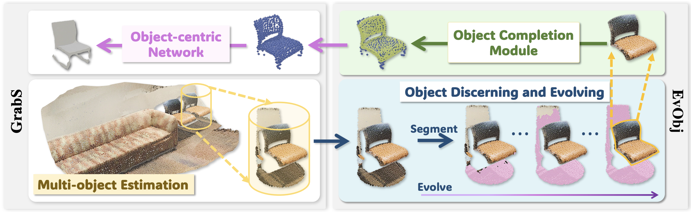
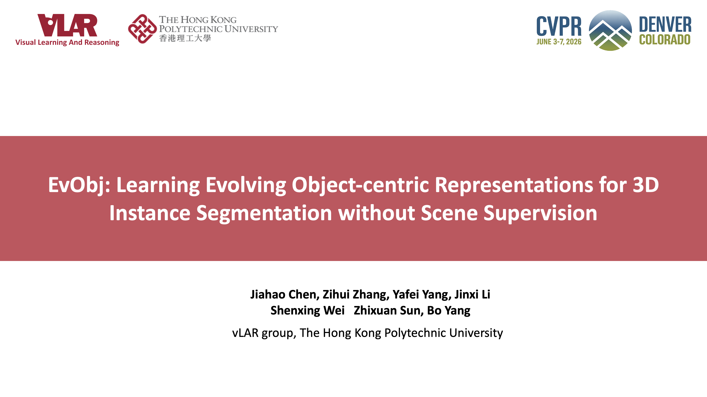

[](https://arxiv.org/abs/2605.13152)
[](https://creativecommons.org/licenses/by-nc-sa/4.0/legalcode)


## EvObj: Learning Evolving Object-centric Representations for 3D Instance Segmentation without Scene Supervision 
[Jiahao Chen](https://d2simon.github.io/), [Zihui Zhang](https://scholar.google.com.hk/citations?hl=en&user=jiwazT8AAAAJ&view_op=list_works&sortby=pubdate), [Yafei Yang](https://yafeiy.github.io/), [Jinxi Li](https://jinxi-li.github.io/), [ShenXing Wei](https://scholar.google.com/citations?user=5RH0zBMAAAAJ&hl=en), Zhixuan Sun, [Bo Yang](https://yang7879.github.io/)


### Poster
<p align="center">  </p>

---

### Overview
We present EvObj, an unsupervised framework that bridges the geometric domain gap between synthetic object priors and real-world 3D scenes.

<p align="center">  </p>

---

### Evolving Mechanism
Our method progressively refines object candidates during the discovery process, enabling robust segmentation under real-world challenges such as occlusions and structural variations:

<p align="center">  </p>


### [Full demo (Youtube)](https://www.youtube.com/watch?v=zpWWP86lzCU)

<p align="center"> <a href="https://www.youtube.com/watch?v=zpWWP86lzCU"></a> </p>


## 1. Environment

### Installing dependencies
```shell script
### CUDA 11.3  GCC 9.4
conda env create -f env.yml
conda activate EvObj

pip3 install 'git+https://github.com/facebookresearch/detectron2.git@710e7795d0eeadf9def0e7ef957eea13532e34cf' --no-deps


cd pointnet2
python setup.py install
cd ../


cd completion_module/extensions/chamfer_dist
python setup.py install
cd ../../../

git clone https://github.com/Pointcept/Pointcept.git
cd Pointcept/libs/pointops
python setup.py install
cd ../../../


pip install "git+https://github.com/erikwijmans/Pointnet2_PyTorch.git#egg=pointnet2_ops&subdirectory=pointnet2_ops_lib"

```
### Install superpoint dependencies
We also create [SPG](https://github.com/loicland/superpoint_graph) superpoints on S3DIS and the Synthetic data, which are used
to help training. So, please compile the dependencies.
```shell script
conda install -c anaconda boost
conda install -c omnia eigen3
conda install eigen

CONDAENV=YOUR_CONDA_ENVIRONMENT_LOCATION ## e.g. /home/jiahao/anaconda3/envs/EvObj
cd partition/ply_c
cmake . -DPYTHON_LIBRARY=$CONDAENV/lib/libpython3.9.so -DPYTHON_INCLUDE_DIR=$CONDAENV/include/python3.9 -DBOOST_INCLUDEDIR=$CONDAENV/include -DEIGEN3_INCLUDE_DIR=$CONDAENV/include/eigen3
make
cd ..
cd cut-pursuit
mkdir build
cd build
cmake .. -DPYTHON_LIBRARY=$CONDAENV/lib/libpython3.9.so -DPYTHON_INCLUDE_DIR=$CONDAENV/include/python3.9 -DBOOST_INCLUDEDIR=$CONDAENV/include -DEIGEN3_INCLUDE_DIR=$CONDAENV/include/eigen3
make
```

## 2. Data Preparation
### ShapeNet
We conduct **chair** segmentation on ScanNet, ScanNet++ and S3DIS datasets. 

To train the **Discerning Module** and **Completion Module**, we first download the watertight mesh from [link](https://s3.eu-central-1.amazonaws.com/avg-projects/occupancy_networks/data/watertight.zip).
Then we use the script `./Render_Occ/render_occ_evobj.py` to render multi-view partial point clouds.


### ScanNet
We exactly follow [Mask3D](https://github.com/JonasSchult/Mask3D) to preprocess the ScanNet dataset. Download the ScanNet dataset from [here](http://kaldir.vc.in.tum.de/scannet_benchmark/documentation). 
Uncompress the folder and move it to  `data/scannet/raw`. Follow Mask3D, we also built superpoints by applying Felzenszwalb and Huttenlocher's Graph-Based Image Segmentation algorithm to the test scenes using the default parameters. 
Please download the ScanNet tool [link](https://github.com/ScanNet/ScanNet) and come into `ScanNet/Segmentor` to build by running `make` (or create makefiles for your system using `cmake`). This will create a segmentator binary file. 
Finally, go outside the `ScanNet` to run the segmentator:
```shell script
./run_segmentator.sh your_scannet_tranval_path ## e.g ./data/scannet/raw/scans
./run_segmentator.sh your_scannet_test_path ## e.g ./data/scannet/raw/scans_test
```
Having the superpoints file, we can run the preprocessing code:
```shell script
python preprocessing/scannet_preprocessing.py
```

### S3DIS
S3DIS dataset can be found [here](https://docs.google.com/forms/d/e/1FAIpQLScDimvNMCGhy_rmBA2gHfDu3naktRm6A8BPwAWWDv-Uhm6Shw/viewform?c=0&w=1). 
Download the files named "Stanford3dDataset_v1.2_Aligned_Version.zip". Uncompress the folder and move it to `data/s3dis_align/raw`. There is an error in `line 180389` of file `Area_5/hallway_6/Annotations/ceiling_1.txt` 
which needs to be fixed manually and modify the `copy_Room_1.txt` in `Area_6/copyRoom_1` to `copyRoom_1.txt`. Then run the below commands to begin preprocessing:
```shell script
python preprocessing/s3dis_preprocessing.py
python prepare_superpoints/initialSP_prepare_s3dis_SPG.py
```

### Synthetic Scenes
Download our data from [Google Drive](https://drive.google.com/file/d/19pyCfWN7W-vvtqUY5tyyGWBUugf0Gjjw/view?usp=drive_link) and put it under the `data/sys_scene_occ/processed`, then run the below command:
```shell script
python prepare_superpoints/initialSP_prepare_sys_SPG.py
```

### Data Structure
After previous downloading and preprocessing, the data structure should be:
```shell script
data
└── scannet
|   └── raw
|   └── processed
└── scannetpp
|   └── data
|   └── splits
|   └── metadata
└── s3dis_align
|   └── raw
|   └── processed
|   └── SPG_0.05
└── sys_scene_occ
|   └── processed
|   └── SPG_0.01
└── chairs
|   └── 03001627
|   └── 03001627_dep
└── shapenet_splits
```

## 3. Object-centric Network training
For the Object-centric Network, we directly using the checkpoint provided by [GrabS](https://github.com/vLAR-group/GrabS). 

The checkpoints for Object-centric Network are available at [Google Drive](https://drive.google.com/file/d/1WoBWTSOvgg4SP_1363y_DjHVrIkBj-Z8/view?usp=sharing)
## 4. Discerning Module training
To train the discerning Module, please run the code below:
```shell script
# Enter the Discerning Directory
cd ./discerning_module/training_code
# Choose dataset mode: single-class (chair) or multi-class (6 categories)

# sparseUnet
CUDA_VISIBLE_DEVICES=0 python train_sparseunet.py 
# PointNet++
CUDA_VISIBLE_DEVICES=0 python train_pointnet2.py 
# PointTransformer V2
CUDA_VISIBLE_DEVICES=0 python train_pointtransformer.py 
```
- `--dataset_mode`: Specifies the Discerning training mode. Type: `str`, default: `single`, choices: [`single`, `multicls`], help: "Discerning module training mode (`single` for chair-only, `multicls` for multi-class)."

The checkpoint for Discerning Module can be downloaded at [Google Drive](https://drive.google.com/file/d/19pyCfWN7W-vvtqUY5tyyGWBUugf0Gjjw/view?usp=drive_link).

## 5. Completion Module training
Thanks to [PoinTr](https://github.com/yuxumin/PoinTr). We use its code to train our completion module.
To train the three types of completion module [AdaPointr](https://arxiv.org/abs/2301.04545)/ [PoinTr](https://arxiv.org/abs/2108.08839)/ [SnowflakeNet](https://arxiv.org/abs/2108.04444), you can run the code below:
```shell script
# Enter the Completion Directory

cd ./completion_module
# CHAIR CLASS
# AdaPoinTr
CUDA_VISIBLE_DEVICES=0 python training_code/main.py --config cfgs/Shapenet_chair/AdaPoinTr.yaml --exp_name chair_adapointr
# PoinTr
CUDA_VISIBLE_DEVICES=0 python training_code/main.py --config cfgs/Shapenet_chair/PoinTr.yaml --exp_name chair_pointr
# SnowFlakeNet
CUDA_VISIBLE_DEVICES=0 python training_code/main.py --config cfgs/Shapenet_chair/SnowFlakeNet.yaml --exp_name chair_snowflake

## MULTI CLASSES
# AdaPoinTr
CUDA_VISIBLE_DEVICES=0  python training_code/main.py --config cfgs/Shapenet6cls/AdaPoinTr.yaml --exp_name sixcls_adapointr
# PoinTr
CUDA_VISIBLE_DEVICES=0  python training_code/main.py --config cfgs/Shapenet6cls/PoinTr.yaml  --exp_name sixcls_pointr
# SnowFlakeNet
CUDA_VISIBLE_DEVICES=0  python training_code/main.py --config cfgs/Shapenet6cls/SnowFlakeNet.yaml  --exp_name sixcls_snowflake

```

The checkpoint for Completion Module can be download at [Google Drive](https://drive.google.com/file/d/19pyCfWN7W-vvtqUY5tyyGWBUugf0Gjjw/view?usp=drive_link). 


## 6. Object Segmentation Network training
### ScanNet
The well-trained object-centric model for **chair** is saved in ```./objnet/chair/vae/``` or ```./objnet/chair/ddpm``` or  by default.
The segmentation model on ScanNet can be trained by:
```shell script
# Enter the ScanNet directory
cd ./scannet

# Train the segnet by VAE SDF
CUDA_VISIBLE_DEVICES=0 python train_scannet_vae.py 

# Train the segnet by ddpm
CUDA_VISIBLE_DEVICES=0 python train_scannet_ddpm.py
```

The script supports the following flexible configuration of the Discerning Module and Completion Module:
- `--discern_backend`: Specifies the backbone network of the Discerning Module. Type: `str`, default: `sparseUnet`, choices: [`sparseUnet`, `pointTransformer`, `pointNet`], help: "Discerning network backend."
- `--discern_net_ckpt`: Path to the pre-trained checkpoint for the Discerning Module backbone. 
- `--comp_backend`: Specifies the backbone network of the Completion Module. Type: `str`, default: `AdaPoinTr`, choices: [`AdaPoinTr`, `PoinTr`, `SnowFlakeNet`], help: "Completion backend."
- `--compnet_ckpt`: Specifies pre-trained checkpoint path for the selected Completion Module backbone. 


### S3DIS
In our main experiments, we conduct a cross-dataset validation that uses the well-trained segmentation model from ScaNet 
to evaluate on S3DIS. For example, to evaluate on S3DIS Area5:
```shell script
# Enter the S3DIS Directory
cd ./s3dis

# ScanNet to S3DIS eval
CUDA_VISIBLE_DEVICES=0 python test_seg_s3dis.py --use_sp=False --cross_test=True --cross_test_ckpt=your_ckpt # e.g.'ckpt_segnet/scannet_VAE_chair/checkpoint_450.tar'
```

### Synthetic Dataset
The well-trained object-centric models on multiple categories are saved in ```./objnet/multi-cate/vae/``` or ```./objnet/multi-cate/diff/``` by default.
We can train a segmentation model on a Synthetic dataset by simply running:
```shell script
# Enter the Synthetic Dataset Directory
cd ./synthetic

# Train the segnet by VAE SDF
CUDA_VISIBLE_DEVICES=0 python train_synthetic_vae.py

# Train the segnet by Diffusion SDF
CUDA_VISIBLE_DEVICES=0 python train_synthetic_ddpm.py
```
The script supports the following flexible configuration of the Discerning Module and Completion Module:
- `--discern_backend`: Specifies the backbone network of the Discerning Module. Type: `str`, default: `sparseUnet`, choices: [`sparseUnet`, `pointTransformer`, `pointNet`], help: "Discerning network backend."
- `--discern_net_ckpt`: Path to the pre-trained checkpoint for the Discerning Module backbone. 
- `--comp_backend`: Specifies the backbone network of the Completion Module. Type: `str`, default: `AdaPoinTr`, choices: [`AdaPoinTr`, `PoinTr`, `SnowFlakeNet`], help: "Completion backend."
- `--compnet_ckpt`: Specifies pre-trained checkpoint path for the selected Completion Module backbone. 


### ScanNet++
In our supplementary materials, we conduct a cross-dataset validation that uses the well-trained segmentation model from ScaNet 
to evaluate on ScanNet++. You can run the code below to run the test:
```shell script
# Enter the ScanNet++ Directory
cd ./scannetpp

# running test code
CUDA_VISIBLE_DEVICES=0  python test_scannetPP_evo.py
```

## 7. Model checkpoints
We also provide well-trained checkpoints for ScanNet and the synthetic dataset in [Google Drive](https://drive.google.com/file/d/19pyCfWN7W-vvtqUY5tyyGWBUugf0Gjjw/view?usp=drive_link). Note that the checkpoints for cross-dataset evaluation on S3DIS/Scannet++ are also trained on ScanNet.
